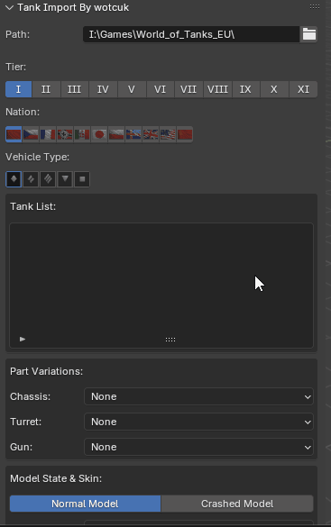

# WoT-Blender-Toolkit
Advanced skeletal modding suite for World of Tanks &amp; BigWorld Engine. Full bone hierarchy support with direct skin-weight painting in Blender 4.3. Engineered for high-precision tank modeling and custom .primitives workflows. A panel for directly importing from the game has also been added.This project is an improved version, with added features, of the Blender Tank Viewer Add-on developed by **SkepticalFox.** I used many sources while developing this addon, I can't mention them all here, but I want to mention that I took the **GeoSpritesV2** node structure, which was made for VFX effects, and modified it for WoT.
**Features currently supported by the addon imports:**
- You can import the model using the .model, .primitives_processed, and .visual_processed files.
- Imported models have a bone painting(vertex weight painting); you can see it in the Weight painting section.
- If the imported model has vertex coloring, the alpha channel is connected by default.
- If you try to import textures during the import process, the code automatically attempts to find the textures using a hierarchy scan, so the textures of the materials are included in the import.
- By pressing the N key, you can open a menu that directly scans the game's .pkg files and imports the desired vehicle model along with its textures.
**Features currently supported by the addon exports:**
- All models can be exported with a 40-byte vertex format with bone components. The exported bones are exported/imported with their inclined axes.
- For exported models, .model, .visual, .primitives, and texture files are automatically created. Depending on the export location, the res_mods hierarchy attempts to write to the .visual and .model files. If the path is incorrect, the game will crash when trying to load the model.
- Texture changes you make in Blender are saved as modified .dds files in the export folder during export. If there is a hierarchy for tanks (tank_name/normal/lod0), texture files are saved directly to the (tank_name) folder; if the file path cannot be found, they are saved to the model's folder.
- Although simple lighting models can currently be imported, they cause problems during export. The main reason for this is that the .visual file is written differently. If you replace the mesh names in the original .visual file with those in the exported file and use that file, you can export the lighting models (with vertex colors).
- The quick export shortcut can be changed in the addon settings.
**Features I plan to add in the future:** 
- To add gravity physics, Turn towards the camera, and initial velocity physics to exported models via Blender, write an automatic script (in the res_mods folder) (for the bones on the tank).
- Writing automated scripts to add gravity physics, initial velocity physics, initial random rotation motion, rotational acceleration, collision engine, and bounce engine to exported models using Blender (for World models).
- Exporting World models (currently only tanks and basic lights are supported, but you can use tank models as World models)
- Direct import and export of .seq files.
*Please feel free to ask if there is any feature you would like to see added or if you have any questions.*
/---------------------------------------------------------------------------------------------
**Version 2.0.0 changes:**
- The skeletal system has been completely revised. Now you can experiment with model deformation live in Blender for animations and bone painting(vertex weight painting) (this is why animations were added).
- Import and export capabilities for all vertex formats have been added.
- The Vertex Color import mechanism has been changed. (For now) Vertex Colors specific to lighting models are visible in the shader. In models with Vertex Color shaders that provide special fabric movement and physics, Vertex Colors can only be viewed for modification purposes.
- The tank scanning mechanism has been improved; tanks are now found using the game's search logic (tank information is extracted from countries' list.xml files, and modifications are taken from the tank's own .xml files).
- VFX mechanisms have been improved, but I don't recommend previewing .vfx files through Blender because node connections aren't established, and .vfx files don't work according to version 1.0.0. However, vfxbin packer and unpacker code compatible with the game's format (for influx CPU effects) has been written, and the ability to modify specific .vfx files from the live game's memory has been added. Further development will likely be undertaken, and I'm considering removing .vfx file previews through Blender due to optimization issues.
- .seq files imports are still not fully developed.
- The animation file import works flawlessly. If the animation file contains information about which model it belongs to, the model is automatically found and loaded. Otherwise, you must load the model first, and then the animation. I will develop the export of animation files further in the future because I need to enable animation modification through Blender; I plan to further develop the animation export logic in the future to fully support live animation modifications within Blender.
- All shaders in the game have been added to the export side (they are also written to the properties during import).
- These are the updates I remember, but with these updates you will now be able to create very specific mods in model development (thanks to vertex colors).
- All texture files have had their formatting errors corrected and are now exported in the format they were imported in (they are converted to tga or png format in Blender so they can be edited in Blender).
- The ANM map rendering has been corrected (red channel alpha), now providing a much closer look to the actual game.
- Minor bug fixes and overall stability improvements
/---------------------------------------------------------------------------------------------

**How to install:** 
Download the project files directly as a zip file 
/Pasted%20image%2020260402100858.png)
and extract them into the Blender folder (Blender Foundation\Blender 4.3\4.3\scripts\addons_core), meaning the files should be in the (Blender Foundation\Blender 4.3\4.3\scripts\addons_core\WoT-Blender-Toolkit-main) folder. The main installation location of Blender is usually (C:\Program Files\Blender Foundation). After setup, activate the addon from the addon settings and assign your own quick export key.
/Pasted%20image%2020260402101914.png)
You can then set your game location and the quick export shortcut from here:
/Pasted%20image%2020260628193810.png)

If you have Unified Editor, you can use its packager to compile .vfx files (I don't recommend this option because packaging takes too long, so I wrote my own packager code, but it can be tried if my code fails). If you also select the Target .vfxbin file, you need to select the file of the .vfx effect you want to modify live in the game's memory.
/Pasted%20image%2020260628194346.png)
/---------------------------------------------------------------------------------------------

**How to use:**
1. **Automatic import**:
	After turning on the blender, press the N button to open and close the side menus.

	/Pasted%20image%2020260402101516.png)
	
	/Pasted%20image%2020260402102251.png)

	The gun part changes live depending on its compatibility with the turret part (the location where the model is called within the .xml file is inside the turret), and since tanks usually have only one hull model (you can't create a hull by searching, except for the Steel Hunter), the information in the skin section is now obtained directly from the .xml file instead of searching through packages. The information in the Available loads section is updated according to the folder where the .model files are located.

	

	After finding your tank, the models are loaded according to the option you choose from the extra settings: Normal model (the one that is not destroyed and is visible in the game) and Crashed (the destroyed tank model). If the model you choose has a skin (some skins have the hull in different locations, so only the turret and chassis may be included), you need to select a skin from the skin list. Based on all the above selections, all available LODs within that package file are presented as options. Since LOD0 is the most detailed model, if you are doing a simple operation, I recommend loading and modifying the LOD0 model and exporting it using quick export. And press the LOAD button.Blender may freeze for a while, but this is normal because import and export processes take time. Instead of showing it at the bottom, I moved it to the top of the cursor. After loading your model, you can switch to material mode to see the texture on the tank. Hold down the Z key and select the option at the bottom.

	/Pasted%20image%2020260628204346.png)

	/Pasted%20image%2020260628204417.png)

	/---------------------------------------------------------------------------------------
2. **Manual import:**
	If you are importing a model from a folder instead of a tank directly from the game, simply click File > Import > BigWorld(.model) and select the .model or .visual_processed file. However, for model import, the .primitives_processed file and the .visual or .visual_processed file must be present. Don't worry if the model is at the Earth's origin when you perform a manual import, because whether you load the entire tank model or just a single model, the export code always considers the SceneRoot nodes on the models as the origin. In other words, all the tank's parts are actually located at the Earth's origin; the game combines these parts by moving them from their SceneRoot locations to the positions of nodes like V and Hp_gunJoint.

	/Pasted%20image%2020260402104257.png)

	
	If you want to quickly export models you've manually imported, like a tank, you need to create a root node named "tank" (the name in the package) and make it the parent of all turret, hull, and chassis root nodes. You can do this by selecting the other root nodes, then selecting the node you just created and pressing CTRL+P while your mouse is inside the scene. You need to add a Custom Property to the main parent node (Tank name) and create a configuration there with the Property name **bw_export_base_path** of **type String**. Inside this property, you need to write the file path to which the exported files will be sent (e.g., vehicles/russian/R45_IS-7/skins/NYst/normal/) *without creating the lod folder.* Finally, you need to add two settings named **bw_export_filename** and **wot_part** (**type String**) to the Custom properties section of the Sceneroot file for the models you imported. In the wot_part section, specify the part **(Chassis, Hull, Turret, Gun)**, and in the bw_export_filename section, specify the export name. It is very important that the bw_export_filename name matches the original file name because this name is also written in the .model file, and the game understands the function of the models based on their file names.

	/Pasted%20image%2020260628205114.png)

	That's all for the model import process.

	/---------------------------------------------------------------------------------------
3. **Editing Textures:**
	After importing your model, while in object mode, select the part of the tank whose textures you want to edit, go to Texture Paint in the top menu, and paint directly from the UV map on the left or from the tank on the right. Currently, it supports editing AM, GMM, and ANM maps; this may be improved in the future. All texture formats in the game are now supported, and there shouldn't be any export errors (all texture formats are in the code, but I haven't been able to test them all, so please report any errors you find). The only possible difference will be between the Blender rendering and the in-game visuals, as the purpose of textures can change depending on the shaders used. Currently, I've improved the export of normal tank and lighting shaders (other models appear similar to the game, but their animations and animation textures aren't directly imported for editing, for example, the existing heat map texture that makes Ares' cannon glow red when it fires). As explained below, you can see in the game that the green channel of the GMM provides metallic scratches and the red channel provides roughness (my shader code currently cannot reflect the roughness provided by the red channel in Blender). Any changes you make to the AM file will appear in the game as is.
	
	**TEXTURE EDITING**
	
	
	
	As you can see in the GIF, you can provide transparency to the model by using the red channel of the ANM file, if it is being used. You can enable the red channel of the ANM files by adding a value node to the "BW BOOL PARAMETERS" parameters, naming it alphaTestEnable, and setting its value to 1.0 (to see the effect, directly link the ANM's red channel to Principled BSDF alpha), or by adding a string parameter named: bw_bool_alphaTestEnable to the custom prop section of the material using that texture and writing true inside it. If there is a parameter representing the custom prop section in the shading part, the shading node will be effective; otherwise, the custom prop section will be effective.

	/---------------------------------------------------------------------------------------
4. **Editing Bones:**
	 First of all, in order to work with any model, the model's mesh must be inside an armature, and the node at the highest hierarchy must be named Scene Root. Therefore, it is recommended to import and modify a pre-existing model. An array represents a file (meaning a file can contain multiple meshes). As far as I know, there is currently no mesh limit. If your model becomes invisible after exporting, it is related to the shader you are using and the bw_renderSet_tawso value. Instead of changing it in the .visual file (if you are creating a model from scratch in Blender, you should create this yourself; its name is bw_renderSet_tawso and its type is Boolean), you can directly change it in the custom prop section of the relevant mesh and see its effect in the game (remember, if you don't enter this parameter, the code will use the value from the scan data by default).

	/Pasted%20image%2020260703002205.png)

	The GIF below is 7.30 minutes long, so you might want to refresh the site to watch it from the beginning. It's so long because I'm explaining weight painting. In summary, when you paint vertex groups, their names must absolutely include BlendBone. After painting the vertex groups, you need to add the bones to which these vertices will be attached. These bones must have the same name as the vertex groups and must be a child (within/subgroup) of the Scene Root. If you want one bone to move with another, for example: If I were to place another movable model on top of the existing model (double-barreled gun), I would need to assign another bone as a child to 1_BlendBone, which is the bone of the original model. If I did this, the new object on top of the gun would move with the gun.
	
	**ADDING BONE TO THE MODEL**
	
	
	
	
	
	To perform the test I did in exposure mode, the mesh needs to have the Armature Modifier. Normally you don't need to do this, but as I said at the beginning, if you're building the structure from scratch, you'll have to add it yourself.
	
	/Pasted%20image%2020260703014435.png)
	
	
	I didn't do a very good job with the bone painting(vertex weight painting) because it was just an example to illustrate; I'm sure you can do it much better than me. In the GIF below, I exported the model to the game using quick export and demonstrated its reaction in-game by moving the bone with a simple script I wrote. As you can see below, I made two mistakes. I didn't set the Tawso parameter to true, so the tank's turret didn't appear initially in the game. This is because when I converted a previously static turret model to a skinned shader, the Tawso parameter needs to be true. This isn't a bug; if you don't change the shader from its original state, you won't encounter this problem. The second issue is that I didn't perform a reverse transform. Because I didn't perform a reverse transform, the model should normally be corrupted during export, but my export code solves this problem. If you rotate only the bone in transitional areas (like the area above the cables in my example), such as the 40%a or 60%b bone connection, you will experience problems.
	
	**ROTATIONAL AXIS TEST AND BONE MOVEMENT CODE**
	
	

	The movement in the x-y-z axes in Blender is the same as the movement in the game (without reverse transformations and rotations (rotation wouldn't be a problem if there weren't transition zones; for example, in my case, only the wires of the weapon are damaged, not the body and tips)). If I had done the bone staining correctly (without the transition), the flexibility of the cable during rotations would have been more realistic.
	
	 **TESTING WITHOUT ROTATION AXIS**
	
	I haven't yet found a solution for the reverse transform, but I plan to in the future. I'll probably create something like a reverse transformation system for bones called BlendBoneR.

	/---------------------------------------------------------------------------------------

5. **Full Tank Export**

	/Pasted%20image%2020260703030807.png)
	
	If you're exporting an entire tank, you might want to change the LOD settings (for example, if you change the LOD1 model, auto-export will export it to LOD2 if you don't make any changes). You can select which LOD you're exporting from these settings, and if you're not exporting the last LOD (i.e., there's a higher LOD), you can select the "There Is a Parent LOD" option to adjust the range at which the currently exported LOD is valid. If you're exporting the last LOD, meaning the model will no longer change with distance, don't select the "There Is a Parent LOD" option. If you don't want to deal with LODs at all, turn off the "Export With LODs" option. Doing so will make the model look the same at all distances, but it may cause a drop in FPS (since the model you changed will be the same for enemies and teammates, they will also be without LODs).
	
	Additionally, there's an advanced overrides panel at the bottom; I strongly advise against using it because it will give the same properties (like shaders) to all the tank's model files. If you do this, the tank's gun might not be exported with a skin, in which case there will be no recoil animation when firing. You should use these options during manual model export; I'll explain them later.
	
	
	/Pasted%20image%2020260703031827.png)
	
	Files and textures are automatically exported to the game's res_mods folder. The export path is set according to the location you entered in the bw_export_base_path section (e.g. vehicles/american/A179_Black_Rock/normal/), and the folders are created accordingly.

	/---------------------------------------------------------------------------------------
6. **Manuel Export and Vertex Colors**
	Currently, all models that can be imported can be exported except for minor errors during export, but since I haven't fully coded the shaders in Blender yet, you may not get the exact same look as in the game. This is because the node connections of the shaders are very variable; for example, the weapon skin added for Tier 11 tanks (I will give an example of this later) moves on its own due to the wind. My code makes node connections like GMM AM, but the vertex colors in this file affect the movement of the vertices, so a special node structure needs to be created. (The appearance is the same as in the game, but the ripple effect is not yet simulated with shaders in Blender. (I created a special folder for shaders; if you want to help me improve the code, you can write and share code that makes node connections for a specific shader, because there are 170 different shaders for models in the game, but about 30-40 of them have different properties)). I made node connections for the lighting models; don't forget to select the lighting option in manual export, this is a template. You can also edit the vertex colors in the lighting models and change the parameters in the shading section. There's a big visual difference compared to the previous version because I adjusted the light shader, but for now I'm ignoring parameters like double-sided (you can change the parameter, it won't make a difference in Blender but it will in the game).
	
	**LIGHT MODELS**
	
	
	
	What I mean by "Vertex format" is that it modifies both the .visual file and the contents of the packaged file (primitives_processed). If your model has vertex color, the color data will be written to the .primitives file, even if it's in a standard tank or under simple lighting.
	
	/Pasted%20image%2020260703120544.png)
	
	If the location where you export the file is a tool location within Resmods, the texture and model files will be automatically located and their file paths will be written. However, if you export to a different folder, you will need to change the file path within the .model file, and the texture files will also be exported to the same folder as the model. Therefore, changing a texture can affect other models in the game; you can try renaming it to ensure it only affects your model. You can create very creative mods with scripts; for example, the normal wind-affected area I created on Ares, as well as the sagging fabric areas of a bony model, can be done with the modeling knowledge and complex scripts I've described so far. (I'll explain the wind-affected static model later.)
	
	**AN EXAMPLE**
	
	
	
	Now I will explain the models affected by wind, using a gun sleeve as an example. Vertex colors determine which areas will be affected, while animation parameters provide information on how much the wind will cause the waves to ripple. As far as I know, currently only the first two of the four parameters (vector4) are functional.
	
	**WIND-SENSITIVE FABRIC**
	
	

	Currently, my addon has some features that aren't working correctly, like .seq, .eff, and .vfx files. I'm not planning on improving these further because Blender doesn't seem to be a suitable environment for it (simulating what a shader does with geometry nodes causes extremely low FPS in Blender). I recommend using Unified Editor for improving these things; maybe I can improve the .vfx part more, but I don't know about the others. Another feature I haven't mentioned is using Blender within World of Tanks. I developed this, but it's incomplete because I couldn't transfer the Blender controls (keyboard) from the game to Blender. I mirrored the Blender window to the game using DirectX hooking, but since this project isn't finished, I won't share the DLL code yet, so don't use the WotLiveSandBox button (under the window menu) in Blender. The animation import works as I described, but I haven't added the export option yet.
	
	**OTHERS**
	
	
	
Please note that this addon is still under development and still contains bugs. If you report them, I will try to fix them, but most of the bugs stem from attempts to automatically configure .visual settings. If you have any questions, you can reach me on Discord for a faster response. (wot0139)

Good luck with your project!
